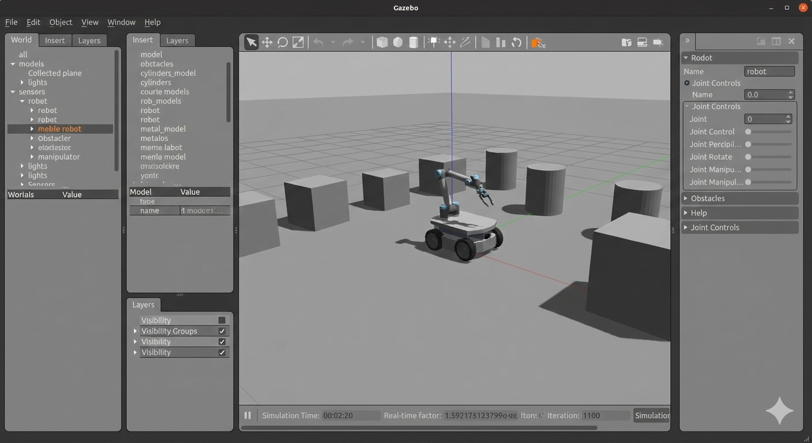

# Chapter 2: Robotics Simulation with Gazebo

## Learning Objectives
- Understand Gazebo's role in robotics simulation
- Learn about Gazebo's physics capabilities
- Explore Gazebo's integration with robotic systems

## 2.1 Introduction to Gazebo

Gazebo is a robotics simulation tool focused on physics-based simulation and robot dynamics. It excels at physics-accurate simulation with realistic dynamics, collisions, and sensor modeling.

### Gazebo's purpose and features
Gazebo provides a rich 3D dynamic simulator with accurate rendering and physics simulation. It is widely used in the robotics community for testing algorithms, robot design, and training.

### Integration with robotics frameworks (e.g., ROS)
Gazebo integrates seamlessly with ROS (Robot Operating System) and other robotics frameworks, making it a standard tool for robotics simulation.

### Comparison with other simulation tools
While other tools exist, Gazebo has established itself as a leading platform for physics-based robotics simulation due to its accuracy and extensive plugin system.

## 2.2 Setting Up Gazebo for Robotics

Getting started with Gazebo for robotics involves several key steps to ensure proper configuration.

### Installation and configuration
Gazebo can be installed through package managers on most Linux distributions, with specific versions available for different ROS distributions.

### Environment creation
Creating realistic simulation environments involves designing 3D models of the physical space where robots will operate.

### Robot model import and setup
Robots are typically defined using URDF (Unified Robot Description Format) files that describe the robot's physical and kinematic properties.

## 2.3 Physics Simulation in Gazebo

Gazebo's physics simulation capabilities are central to its functionality for robotics applications.

<!---->

### Physics engine configuration
Gazebo supports multiple physics engines including ODE, Bullet, and DART, each with different characteristics for accuracy and performance.

### Gravity, collision, and dynamics settings
These parameters can be configured to match real-world conditions or to test specific scenarios.

### Realism vs performance considerations
Gazebo allows users to balance simulation accuracy with computational requirements based on their specific needs.

## 2.4 Sensor Integration in Gazebo

One of Gazebo's key strengths is its realistic sensor simulation capabilities.

<!---->

### Adding sensors to robot models
Sensors are defined in URDF files with Gazebo-specific extensions that specify the sensor type and parameters.

### Configuring sensor parameters
Each sensor type has specific parameters that can be tuned to match real-world sensor characteristics.

### Understanding sensor simulation in Gazebo
Gazebo simulates various sensor types including LiDAR, cameras, IMUs, and more with realistic noise models.

## 2.5 Summary and Key Takeaways

This chapter covered Gazebo's role in robotics simulation. Key takeaways include:

- Gazebo excels at physics-accurate simulation with realistic dynamics and sensor modeling
- It integrates well with robotics frameworks like ROS
- It provides configurable physics parameters for balancing accuracy and performance
- It offers realistic sensor simulation for various sensor types

The next chapter will explore Unity's role in high-fidelity visualization for robotics simulation.

## Assessment Criteria

After completing this chapter, students should be able to:

- Explain Gazebo's role in robotics simulation
- Describe Gazebo's physics capabilities and supported physics engines
- Understand how to set up Gazebo for robotics applications
- Explain how sensors are integrated in Gazebo and the types of sensors supported
- Identify the trade-offs between realism and performance in Gazebo