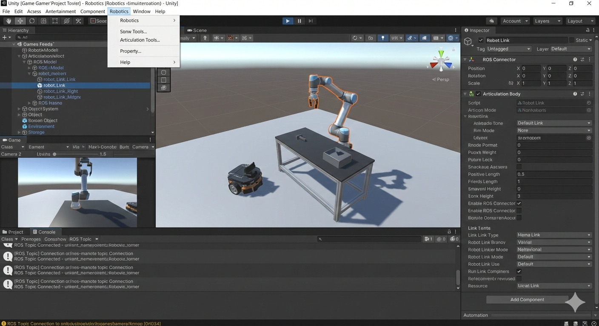

# Chapter 3: High-Fidelity Simulation and Interaction with Unity

## Learning Objectives
- Understand Unity's role in high-fidelity simulation
- Learn about Unity's visualization capabilities
- Explore interaction and user interface design

## 3.1 Introduction to Unity for Robotics

Unity is a visualization platform providing high-fidelity graphics and interactive environments. Unity excels at high-fidelity visualization, rendering, and user interaction.

### Unity's purpose in robotics simulation
Unity provides advanced visualization capabilities that complement the physics simulation provided by tools like Gazebo, offering a complete simulation ecosystem.

### Visualization vs physics simulation roles
While Gazebo focuses on accurate physics simulation, Unity focuses on creating immersive, high-quality visual experiences.

### Integration possibilities with other tools
Unity can be integrated with physics simulation tools through various middleware and communication protocols.

## 3.2 High-Fidelity Visualization

Unity's visualization capabilities set it apart in the robotics simulation landscape.

<!---->

### Creating realistic environments
Unity's powerful rendering engine allows for the creation of photorealistic environments with detailed textures, lighting, and effects.

### Material and lighting setup
Realistic materials and lighting are crucial for creating believable simulation environments that match real-world conditions.

### Rendering techniques for robotics
Unity offers various rendering techniques including real-time ray tracing and advanced shading that can enhance robotics simulation.

## 3.3 Interaction and User Interfaces

Unity excels at creating interactive experiences and user interfaces for simulation.

### Designing user interaction systems
Unity provides tools for creating intuitive interfaces that allow users to interact with simulation environments and robots.

### Control interfaces for simulation
Custom control interfaces can be built to allow users to manipulate robots and environments directly.

### Visualization of robot data
Unity can display robot sensor data, paths, and other information in intuitive visual formats.

## 3.4 Combining Tools: Unity with Physics Simulation

The combination of Unity's visualization with physics simulation tools creates powerful simulation environments.

<!---->

### Integration approaches (e.g., ROS integration)
Various integration approaches exist, including ROS# bridge, Unity Robotics Package, and custom communication protocols.

### Combining Gazebo physics with Unity visuals
This approach leverages Gazebo's accurate physics while using Unity's superior visualization capabilities.

### Workflow considerations
When combining tools, considerations include data synchronization, performance optimization, and maintaining consistency between systems.

## 3.5 Summary and Key Takeaways

This chapter explored Unity's role in high-fidelity robotics simulation. Key takeaways include:

- Unity excels at high-fidelity visualization and user interaction
- It complements physics simulation tools like Gazebo
- It provides powerful tools for creating immersive simulation environments
- Integration with other tools enables comprehensive simulation solutions

This concludes Module 2, which has covered digital twins, physics simulation, Gazebo, Unity, and sensor simulation in the context of robotics.

## Assessment Criteria

After completing this chapter, students should be able to:

- Explain Unity's role in high-fidelity robotics simulation
- Describe Unity's visualization capabilities and rendering techniques
- Understand how to design interaction and user interfaces in Unity
- Explain how Unity can be integrated with physics simulation tools
- Identify the benefits of combining Gazebo physics with Unity visuals